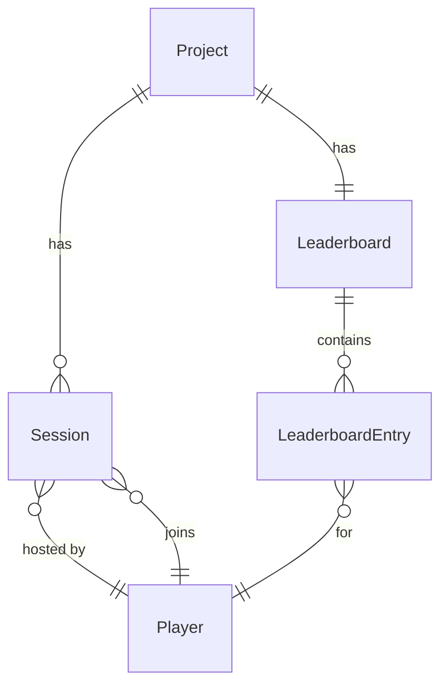
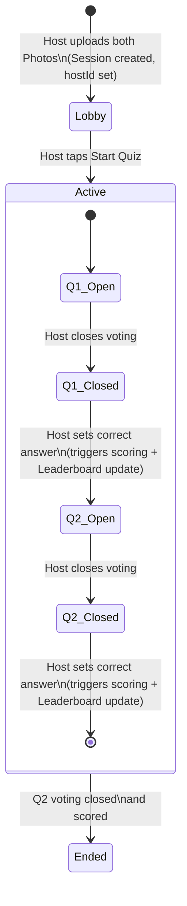

# Daily Fleece – Domain Model

## Entities

### Project
The organisational scope that groups Sessions and their Leaderboard. Every Session and every Player's score belongs to exactly one Project. One global Project exists for now; the model is multi-Project-ready from day one.

### Player
A participant identified by an app-generated stable ID. The display name is a separate attribute and not the identity. This stable ID survives the future migration from stub (name-based) auth to company SSO. The Players collection is a thin identity registry — no scores or session history.

### Session
A single daily quiz instance scoped to a Project. Discovered by date — there is at most one Session per Project per day, no join code needed. The session date is a `YYYY-MM-DD` string determined by the server's configured timezone. A Session embeds its players (with display names), photo references, and all voting state including answers. It is the primary read document for every screen during an active quiz.

### Photo
An image uploaded by the Host before the Session starts. Stored in GridFS. A Session holds references to exactly two Photos (Q1 and Q2). Photos have a 28-day TTL.

### Answer
A Player's response to a Question, embedded in the Session document under `voting.q1.answers` or `voting.q2.answers`. Answers are stored as a map keyed by `playerId` — this allows a simple `$set` for both first answers and changes, with no conditional logic. Whether an answer is correct is always derived by comparing it against `voting.qN.correctAnswer`; it is never stored separately.

### Leaderboard
A pre-computed aggregate scoped to a Project. One document per Project. Contains one entry per Player who has participated in any Session in that Project, ordered by total Points descending. Each entry embeds the Player's display name, total Points, and sessions participated in. Updated in a single batch write when the Host sets the Correct Answer (Computed Pattern). Name changes propagate to this document.

---

## Entity Relationships



---

## Session Lifecycle



---

## Document Shapes

### Session

```json
{
  "_id": "<session-id>",
  "projectId": "default",
  "date": "2026-05-24",
  "phase": "Lobby | Active | Ended",
  "hostId": "abc",
  "players": [
    { "playerId": "abc", "displayName": "Thomas" },
    { "playerId": "def", "displayName": "Anna" }
  ],
  "photos": {
    "q1": "<gridfs-id>",
    "q2": "<gridfs-id>"
  },
  "voting": {
    "q1": {
      "status": "Open | Closed",
      "correctAnswer": null,
      "answers": {
        "abc": { "displayName": "Thomas", "answer": "A" },
        "def": { "displayName": "Anna", "answer": "B" }
      }
    },
    "q2": {
      "status": "Open | Closed",
      "correctAnswer": null,
      "answers": {}
    }
  }
}
```

### Player

```json
{
  "_id": "<player-id>",
  "displayName": "Thomas"
}
```

### Leaderboard

```json
{
  "_id": "<leaderboard-id>",
  "projectId": "default",
  "entries": [
    { "playerId": "abc", "displayName": "Thomas", "totalPoints": 18, "sessionsParticipated": 12 },
    { "playerId": "def", "displayName": "Anna",   "totalPoints": 15, "sessionsParticipated": 11 }
  ]
}
```

---

## Module Event

When Q2 is scored and the Session transitions to Ended, the `quiz` module publishes a scoring event consumed by the `player` module to update the Leaderboard:

```json
{
  "projectId": "default",
  "scores": { "abc": 2, "def": 1, "ghi": 0 }
}
```

`quiz` computes correctness before firing — `player` receives only the final per-player totals and increments `totalPoints` and `sessionsParticipated` in one batch write.

---

## Key Design Decisions

- **Answers embedded in Session as a map**: keyed by `playerId` so any update (first answer or change) is a single atomic `$set`. Correctness is derived at read time — `isCorrect` is never stored.
- **Leaderboard is one document per Project**: follows the Computed Pattern. All entries fetched together for the leaderboard screen. Updated in one batch write at scoring time.
- **Store together what you fetch together**: display names are denormalised into Session and Leaderboard. Name changes propagate to both.
- **MongoDB is the sole datastore**: Valkey was dropped — the app's scale (one team, ~20 players) does not justify a second datastore. See ADR-0002.
- **Session date as string**: `LocalDate` / `YYYY-MM-DD`, server timezone is the source of truth. Multi-timezone support is deferred.
- **One session per day enforced by unique index** on `(projectId, date)`. Creating a session when one already exists returns `409 Conflict`; the client informs the user a session already exists and offers a join option.
- **Abandoned sessions** (stuck in Lobby or Active) are resolved by manual admin deletion for now. No automatic cleanup or host-takeover logic.
- **Seamless reconnection**: a player who refreshes or reconnects re-enters their name, recovers their `playerId`, and the client reads current session state to render the correct screen.
- **Q2 answers stored as ISO 3166-1 alpha-2 country codes** (e.g. `"DE"`).
- **Duplicate display names are allowed** — no uniqueness constraint on `displayName` in the Players collection.
- **Session Results** shows a table: name, Q1 result (correct/incorrect), Q2 result (correct/incorrect). Correctness is derived at read time by comparing each player's answer against `correctAnswer`.
